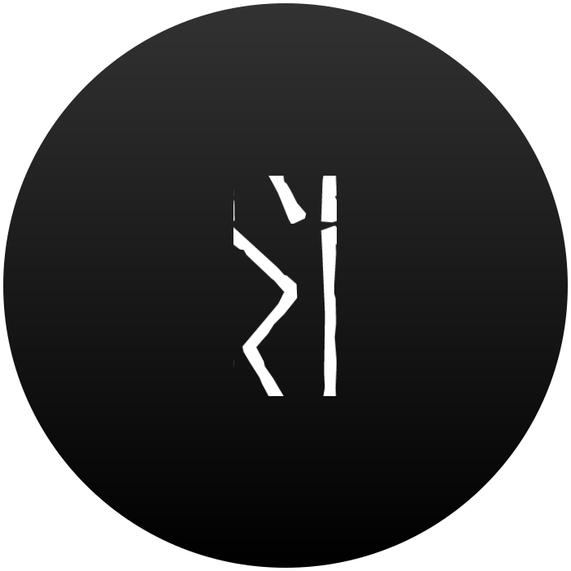
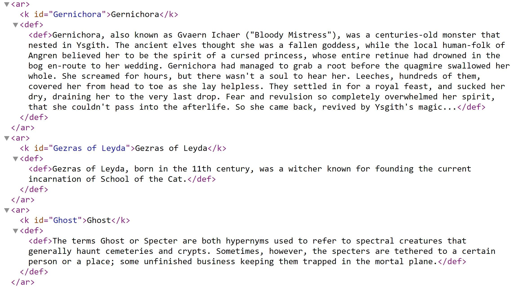

<div id="top"></div>

<!-- PROJECT LOGO -->
<br />

  <a align="left" href="https://runik.app">
    
  </a>

<!-- ABOUT THE PROJECT -->

## Runik Dictionary Generation Microservice

🛡️ A RESTful API microservice that generates human-readable xml dictionaries for your favourite fictional worlds. Dictionaries are built by parsing data consumed from MediaWiki.

<p align="center">
    
</p>


### Built With
-   
-   
-   
-   


<!-- GETTING STARTED -->

## Getting Started

### 1. Download starter and install dependencies

Clone this repository:

```
git clone git@github.com:Runik-3/dictionary-generation-rest-service.git
```

Install npm dependencies:

```
cd dictionary-generation-rest-service
npm install
```

### 2. Start Development Server

```
npm run dev
```

The server is now running on http://localhost:3000.

<!-- USAGE EXAMPLES -->

## Usage

--

<!-- ROADMAP -->

## Roadmap

<!-- -   [x] Add Changelog -->

-   [ ] Add name splitting
-   [ ] Add more robust unit tests

See the [open issues](https://github.com/Runik-3/dictionary-generation-rest-service/issues) for a full list of proposed features (and known issues).

<!-- CONTRIBUTING -->

## Contributing

Contributions are what make the open source community such an amazing place to learn, inspire, and create. Any contributions you make are **greatly appreciated**.

<!-- If you would like to contribute, please have a look at our [contributing guidelines](https://github.com/BCIT-DDC/docs/blob/main/contributing.md). -->

### Contributors

This project exists thanks to all the people who contribute.
<br/>
<a href="https://github.com/Runik-3/dictionary-generation-rest-service/graphs/contributors">

</a>

<!-- TESTING -->

<!-- ## TESTING -->

<!-- LINTING -->

<!-- ## Linting -->

<!-- LICENSE -->

## License

[GPL-3.0](LICENSE.md) © Runik

<!-- ACKNOWLEDGMENTS -->

## Acknowledgments

-   [Fandom](https://www.fandom.com/)
-   [MediaWiki](https://www.mediawiki.org/wiki/MediaWiki)
